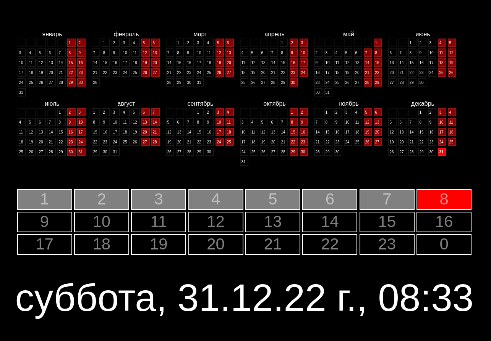
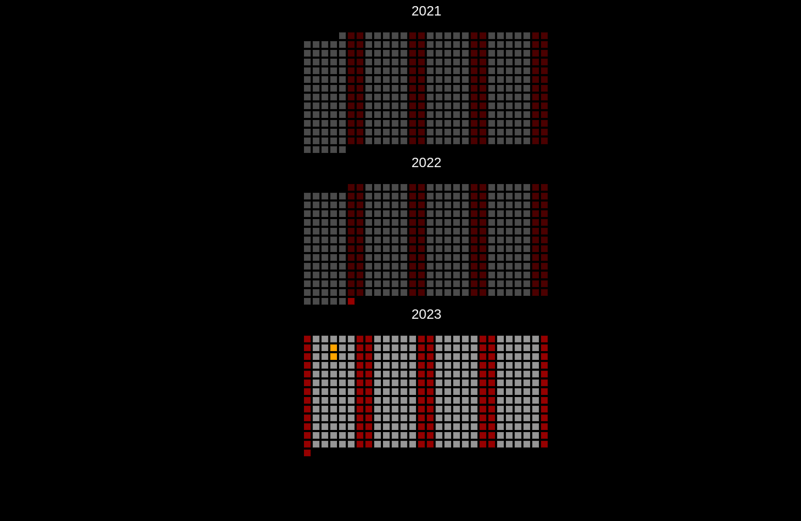

# wapp_calendar

Календарь.

- произносится каждый час
- календарь текущего года
    - дни подписанные по месяцам
- каледнарь с днями для меток за 3 года




## Запуск

```bash
wget https://github.com/hightemp/wapp_calendar/releases/latest/download/wapp_calendar.pyz
chmod a+x ./wapp_calendar.pyz
./wapp_calendar.pyz
```

## Упаковка

```bash
# https://docs.python.org/3/library/zipapp.html
python3 -m zipapp wapp_calendar -p "/usr/bin/env python3"
```